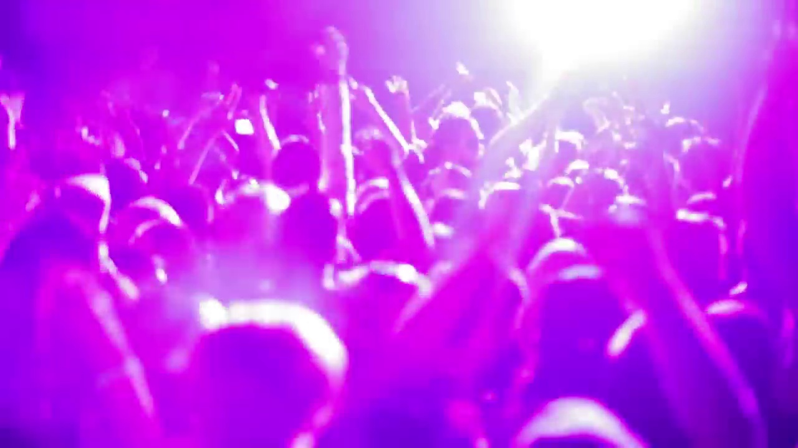

# TuneAI: Video/Image to Audio

Generative AI technology for audio content creation.

## Going from Video to Audio, an example process:
**Visual Input**: [Video background party](https://www.youtube.com/watch?v=4qz6x8y3tNw)

**One Snapshot**: 

**Captions with Blip**: ['purple light shining on a crowd of people at a concert', 'purple light shining on a crowd of people at a concert', 'crowd of people at a concert with their hands in the air']

**Prompt generation with OpenAI**: EDM, Energetic, Pop with pulsating beats, synths, and euphoric crowd samples.

**Audio generation with MusicGen**: [10s music](backend/audio/party.wav)

### Other Video Sources
[Australia vs USA | Women's Beach Volleyball Gold Medal Match | Tokyo Replays](https://www.youtube.com/watch?v=459Oda8XPy0)
[Video background party](https://www.youtube.com/watch?v=4qz6x8y3tNw)
[Fly Me To The Moon - Stringspace Jazz Band](https://www.youtube.com/watch?v=EpjcSfnWqAk)
[Eating at Grand Central Oyster Bar NYC. Tourist Trap? or Classic Restaurant?](https://www.youtube.com/watch?v=BbrHLzx_D_8)